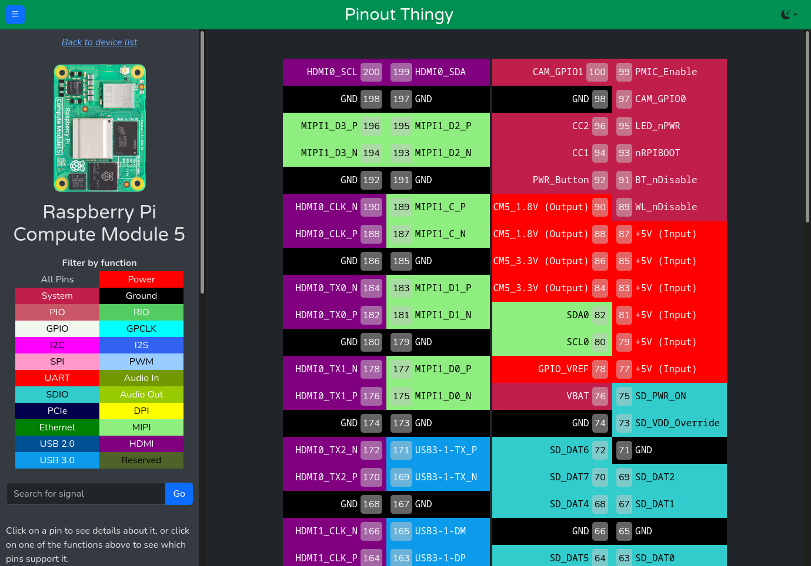

# Pinout Thingy
Hi!  *Pinout Thingy* is an interactive pinout tool.  You can click on each pin to get more info about the pin and it's alternate functions, and you can filter pins by function!

Originally it only showed the pinout for the Raspberry Pi Compute Module 4, but since the CM5 came out it can show the pinouts of multiple devices!  (Well, ok, for now it's just the CM4 and CM5.  But now that _it can_ show more than one pinout I have an excuse to add additional devices...)

A live version of the webpage can be found at [atctwo.net/projects/pinout](https://atctwo.net/projects/pinout).  If you spot any errors with any of the pinouts, or have any other suggestions, please raise an issue, and I'll fix it as soon as possible!  If you want to add additional devices yourself feel free to raise a PR!

# Features
- Shows the pinouts of a number of devices
  - You can click on each pin to show a short description, as well as any alternate functions
  - The table on the sidebar allows you to filter by function, highlighting any pin that supports that function
  - If the function has multiple controllers (eg: I2C0, I2C1, etc), you can filter by those too
  - There's a search box if you can't find what you're looking for
- Supports dark mode

## Supported Devices

Show Supported Devices

<ul>
    <li><a href="https://atctwo.net/projects/pinout?device=cm4">Raspberry Pi Compute Module 4</a></li>
    <li><a href="https://atctwo.net/projects/pinout?device=cm5">Raspberry Pi Compute Module 5</a></li>
</ul>

# Credits
Sources for data on each pinout are contained within the device manifests, and are shown on the device page in the sidebar.

The original version of the site was written in plain HTML5/CSS/JS, but since "version 2" it now uses a little bit of Bootstrap 5.  The site uses [Fuse.js](https://www.fusejs.io/) for fuzzy searching.
